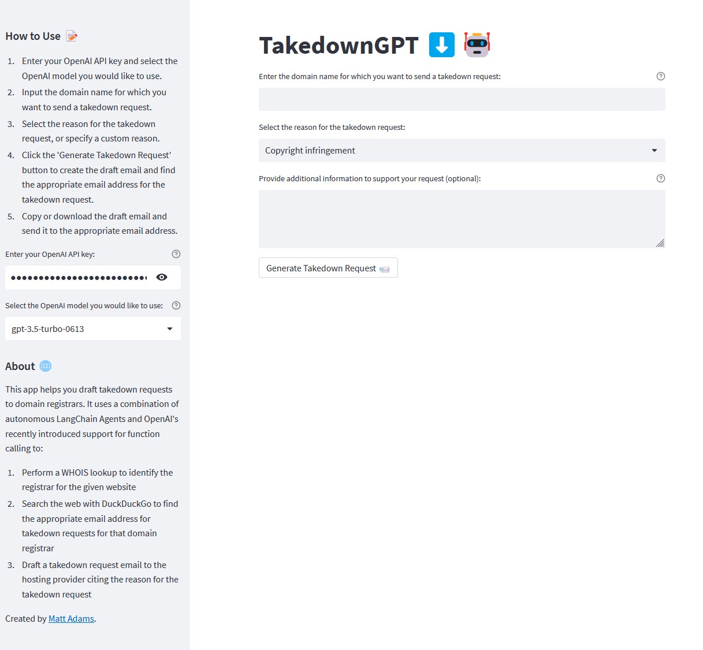

# TakedownGPT ⬇️🤖

This Streamlit app helps you draft takedown requests to domain registrars.

It uses a combination of autonomous LangChain Agents and OpenAI's recently introduced support for function calling to:

1. Perform a WHOIS lookup to identify the registrar for the given website
2. Search the web with DuckDuckGo to find the appropriate email address for takedown requests for that domain registrar
3. Draft a takedown request email to the hosting provider citing the reason for the takedown request

Created by [Matt Adams](https://www.linkedin.com/in/matthewrwadams/).



[Click here to try the live app!](https://takedowngpt.streamlit.app)

## Installation

1. Clone this repository:

```bash
git clone https://github.com/mrwadamstakedown-gpt.git
cd takedown-gpt
```

2. Install the required Python packages:

```bash
pip install -r requirements.txt
```

3. Run the Streamlit app:

```bash
streamlit run app.py
```

## Usage

1. Enter your OpenAI API key and select the OpenAI model you would like to use.
2. Input the domain name for which you want to send a takedown request.
3. Select the reason for the takedown request, or specify a custom reason.
4. Click the 'Generate Takedown Request' button to create the draft email and find the appropriate email address for the takedown request.
5. Copy or download the draft email and send it to the appropriate email address.