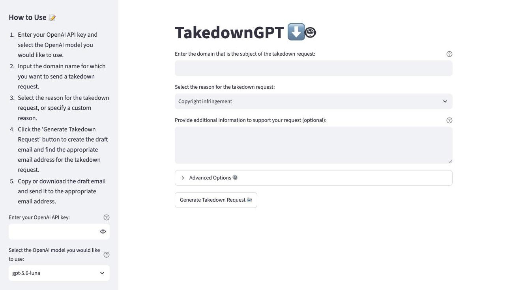

# TakedownGPT ⬇️🤖

This Streamlit app helps you draft takedown requests to domain registrars.

It uses a LangChain agent that calls tools in a loop to:

1. Perform a domain registrar lookup using either WHOIS or RDAP to identify the registrar for the given website
2. Search the web with DuckDuckGo to find the appropriate email address for takedown requests for that domain registrar
3. Draft a takedown request email to the registrar citing the reason for the takedown request

You can choose your preferred lookup protocol (WHOIS or RDAP) from the "Advanced Options" menu.

The app runs on OpenAI's GPT-5.6 models — `gpt-5.6-luna` (fast, low cost), `gpt-5.6-terra` (balanced), and `gpt-5.6-sol` (flagship) — which are driven through OpenAI's Responses API so the agent's tool calling works with these reasoning models.

Created by [Matt Adams](https://www.linkedin.com/in/matthewrwadams/).



[Click here to try the live app!](https://takedowngpt.streamlit.app)

## Installation

Python 3.10 or newer is required.

1. Clone this repository:

```bash
git clone https://github.com/mrwadams/takedown-gpt.git
cd takedown-gpt
```

2. Create and activate a virtual environment:

```bash
python -m venv .venv
source .venv/bin/activate    # on Windows: .venv\Scripts\activate
```

3. Install the required Python packages:

```bash
pip install -r requirements.txt
```

4. Run the Streamlit app:

```bash
streamlit run app.py
```

## Usage

1. Enter your OpenAI API key and select the OpenAI model you would like to use.
2. Input the domain name for which you want to send a takedown request.
3. Select the reason for the takedown request, or specify a custom reason.
4. Click the 'Generate Takedown Request' button to create the draft email and find the appropriate email address for the takedown request.
5. Copy or download the draft email and send it to the appropriate email address.

## Troubleshooting

- **`ModuleNotFoundError: No module named 'tldextract'` (or another dependency)** — Streamlit is running from an environment that doesn't have the requirements installed. Activate the virtual environment first (`source .venv/bin/activate`), or run `pip install -r requirements.txt` in whichever environment you launch `streamlit` from.
- **`Error code: 401 - invalid_api_key`** — the key entered in the sidebar isn't a valid OpenAI key. Keys start with `sk-` (or `sk-proj-`); check for a truncated paste or stray whitespace, and confirm the key is active with available quota.
